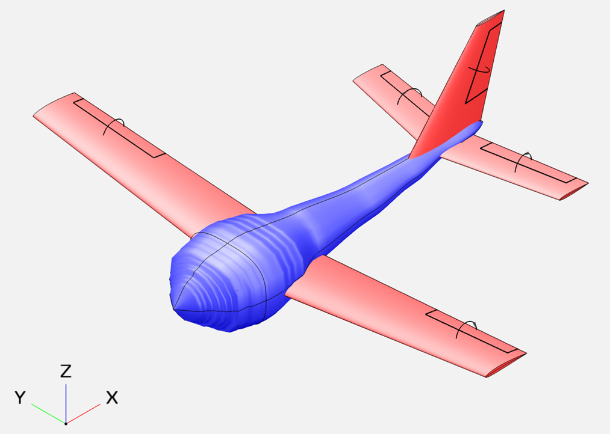
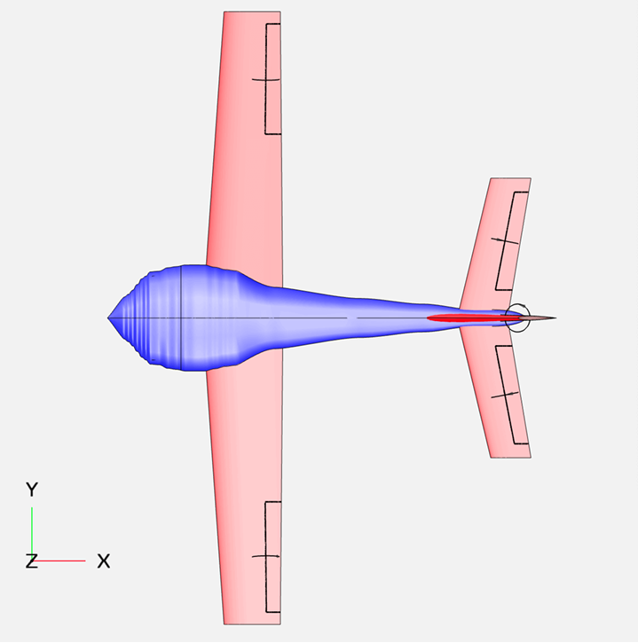
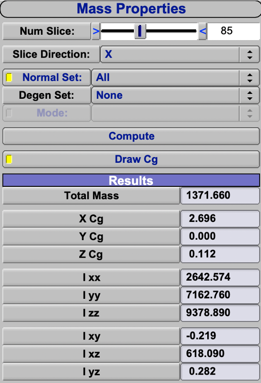
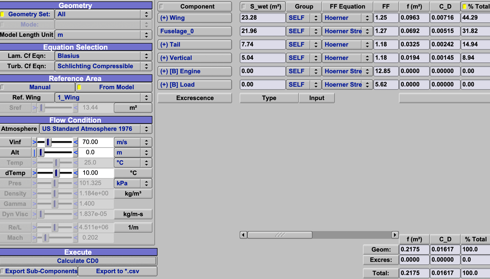
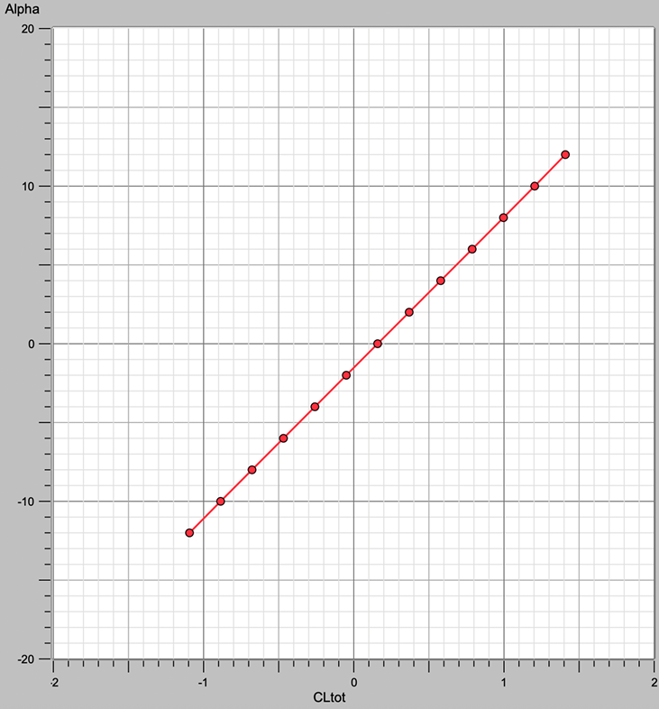
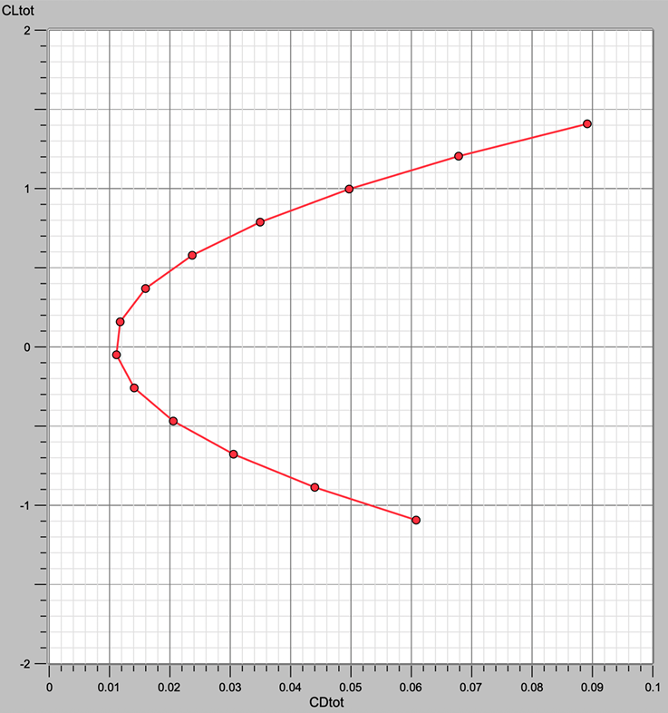
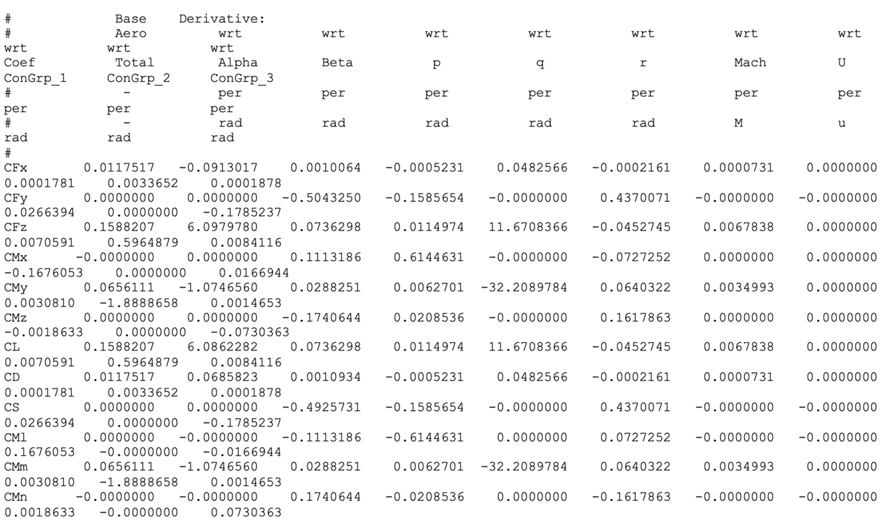

# Aircraft Concept Design using OpenVSP

## Overview

This project presents the conceptual design and flight mechanics analysis of a conventional subsonic aircraft developed using OpenVSP and MATLAB.

The work includes:

- Aircraft geometry design
- Mass and inertia estimation
- Aerodynamic analysis
- Stability derivative evaluation
- Trim condition analysis
- Dynamic mode assessment

# Aircraft Configuration

The aircraft was designed to satisfy strict geometric and aerodynamic constraints while maintaining stable flight characteristics.

Main features:

- Wingspan: 11 m
- Wing area: 13.44 m²
- Aspect ratio: ≈ 9
- Taper ratio: 0.7
- Sweep angle: 4°
- Dihedral angle: 5°
- Fuselage length: 7.5 m
- Maximum fuselage diameter: 1.9 m

---

# Design Requirements

The aircraft had to satisfy the following requirements:

- Maximum footprint constrained within a 12 m square
- Total mass between 1200 kg and 1800 kg
- Cruise speed of 70 m/s
- Payload mass of 500 kg
- Stable longitudinal and lateral-directional dynamic modes

---

# OpenVSP Model

The complete aircraft geometry was developed using OpenVSP.

## Aircraft Render

## Top View

# Mass Properties

The final aircraft mass is:

- **1371.66 kg**

Computed center of gravity:

- **CG = [2.696, 0.000, 0.112] m**

## Mass Properties Visualization

---

# Aerodynamic Analysis

Aerodynamic analyses were performed using VSPAERO and analytical methods.

Main results:

- Parasite drag coefficient:
  
  \[
  C_{D0} = 0.01617
  \]

- Lift curve slope:

  \[
  C_{L\alpha} = 6.086 \; rad^{-1}
  \]

## Parasite Drag Breakdown

## Lift Curve

## Aerodynamic Polar

---

# Stability and Control

The aircraft exhibits stable longitudinal and lateral-directional behavior.

Main stability derivatives:

\[
C_{m\alpha} = -1.074656
\]

\[
C_{n\beta} = 0.1741
\]

\[
C_{l\beta} = -0.111
\]

## Stability Derivatives

---

# Trim Analysis

Trim calculations were performed for steady-level flight conditions.

Computed trim values:

- Trim angle of attack:

  \[
  \alpha_{trim} = 1.53^\circ
  \]

- Elevator trim deflection:

  \[
  \delta_{trim} = 1.12^\circ
  \]

# Dynamic Modes

Dynamic stability analysis confirmed stable aircraft behavior.

Analyzed modes include:

- Short-period mode
- Phugoid mode
- Roll mode
- Dutch roll
- Spiral mode

# Tools and Software

- OpenVSP
- VSPAERO
- MATLAB
- Flight Mechanics analytical methods

---

# Author

Simone Muscolino  

---

# License

This project is released under the MIT License.
